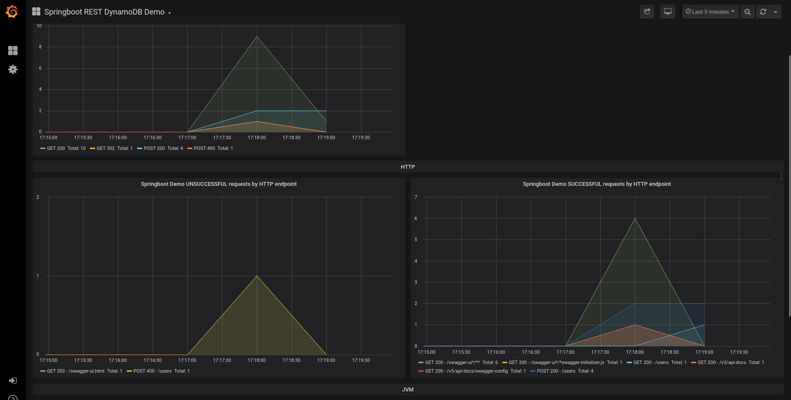

# springboot 3 rest/aws dynamodb/metrics/grafana demo

### overview
This demo repository contains a springboot 3 maven project which

* exposes a Spring MVC REST API to maintain a 'user' object
* uses a localstack-hosted (see docker-compose file) dynamo database to store the data received over the REST API, using the AWS SDK libraries
* sends metrics to a configured influxDB using the micrometer libraries 
* exposes swagger/open-api interface information - once started, see [here](http://localhost:8080/swagger-ui.html)

### docker-compose
The docker-compose.yml file contains configuration for
* starting a localstack docker container to mimic an AWS environment for dynamoDB
* starting an influx DB docker container
* starting a grafana docker container which is configured to 
  * access influx by default
  * expose a default dashboard of metrics from the demo springboot application
* starting the demo springboot project which
  * is configured to use localstack hosted dynamoDB
  * is configured to send default metrics to influxDB

It will start all containers locally. The springboot app contains default connectivity to influxDB, as does grafana

The dynamo viewer dashboard can be viewed, once started, see [here](http://localhost:8001)

The grafana dashboard can be viewed, once started, see [here](http://localhost:3000)

### to see the demo ......
* you'll need docker/docker-compose installed locally - you'll have to check that out yourself ..
* clone this repository to your local disk
* build the springboot demo. If you want to do this yourself, you'll need maven and java 17 installed
  * on the command line in the root directory (i.e. the same directory as the 'pom.xml' file), type
```agsl
mvn clean install
```
* once the build finishes, there should be a file 'spring-boot-rest-awsdynamodb-metrics-demo-0.0.1-SNAPSHOT.jar' visible in the target directory
* on the command line in the root directory (i.e. the same directory as the 'docker-compose.yml' file), type
```agsl
docker-compose build
```
* this instruction prepares the docker containers necessary to run the demo
* when this instruction is complete, type:
```agsl
docker-compose up
```
* this should start all of the necessary containers

Once all containers are running, you can proceed to add some data over the demo REST API
* click [here](http://localhost:8080/swagger-ui.html) to access and use the Open API documentation to add some data 
  * Add some data:
    * Find the POST /users option and select 'Try it out'
    * Click on the 'Execute' button a few times
  * Query the data you've just added
    * Find the GET /users option and click 'Try it out'
    * Click on the 'Execute' button a few times
* This activity will now be visible
  * in dynamo viewer as stored dynamo records
  * in grafana, having been stored in the influxDB
    * click [here](http://localhost:3000) and then find and click on the springboot-demo dashboard
* Err ... that's it

### tests and code coverage
The project is also configured to produce code coverage data using the jacoco maven plugin.
After a build, this information can be found here: target/site/jacoco/index.html

## Example Grafana metrics after REST API activity
